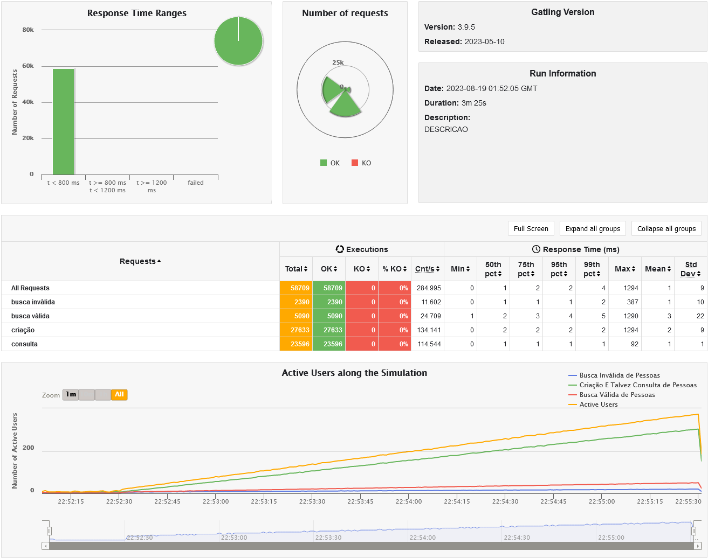
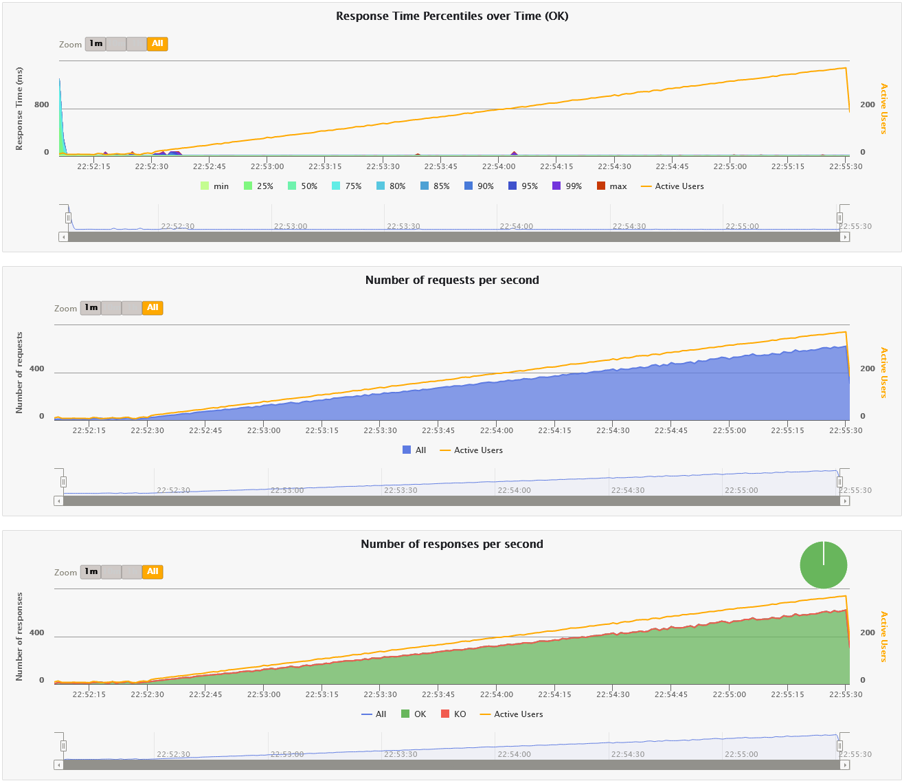

# Rinha backend .NET

## Stack:
- CSharp (C#)
- .NET 7
- Nginx (Load balancer)
- Postgres (Database)

## Stress test
Para o rodar o benchmark, é necessário ter o [gatling](https://gatling.io/docs/gatling/tutorials/installation/)
instalado na máquina, e alterar a variável `GATLING_BIN_DIR` no arquivo `stress-test/run.sh` com o caminho até a pasta bin do gatling.

Par executar o teste basta digitar o comando:
```bash
stress-test/run.sh
```

## Ultimo benchmark

